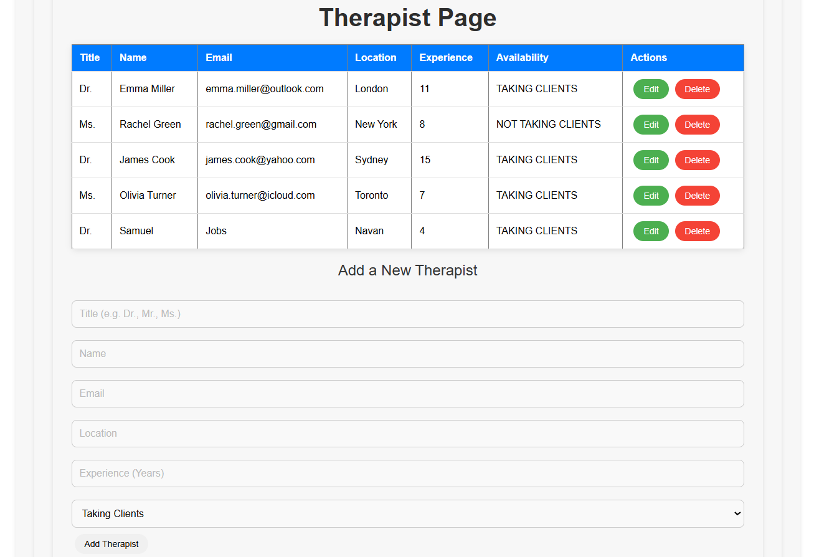
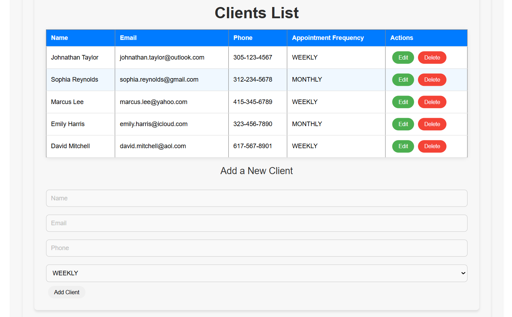
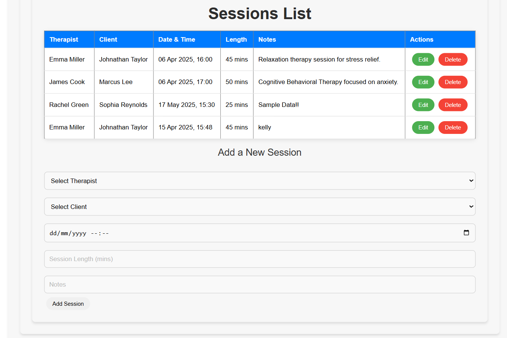
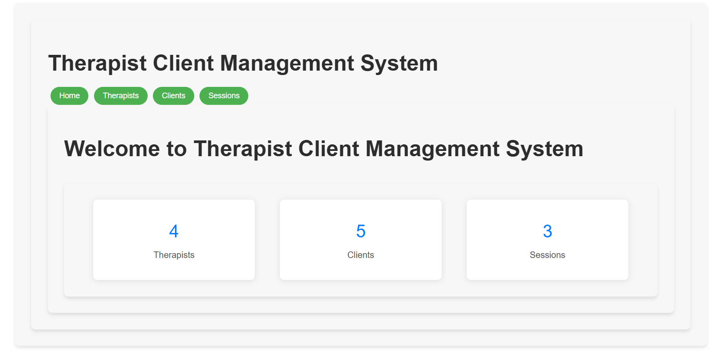

# 🧠 Therapist-Client Management System

A full-stack web application designed to help manage therapists, clients, and sessions efficiently. Built as part of a university lab project using modern web technologies.

## ✨ Features

- 📋 Add, edit, and delete therapists, clients, and session records
- 📂 Organized routing and controller structure
- 📦 Backend with Node.js, Express
- 🎨 Frontend with React and CSS
- 🌐 RESTful API integration between frontend and backend

## 🛠️ Tech Stack

**Frontend**  
- React  
- React Router  
- CSS

**Backend**  
- Node.js  
- Express  
- dotenv  
- CORS

---
## Screenshots

### Therapist Management

This screenshot shows the therapist management page where you can view, add, update, and delete therapist records.



### Client Management

The client management page where you can perform CRUD operations on client data.



### Session Management

Manage therapy sessions by scheduling and assigning them to therapists and clients.



### Home Page

The home page of the system provides a quick overview of available features and navigation options.



---

## 🚀 Getting Started

### 1. Clone the Repository

```bash
git clone https://github.com/samuelo21423/Therapist-Client-Management-System.git
cd Therapist-Client-Management-System

